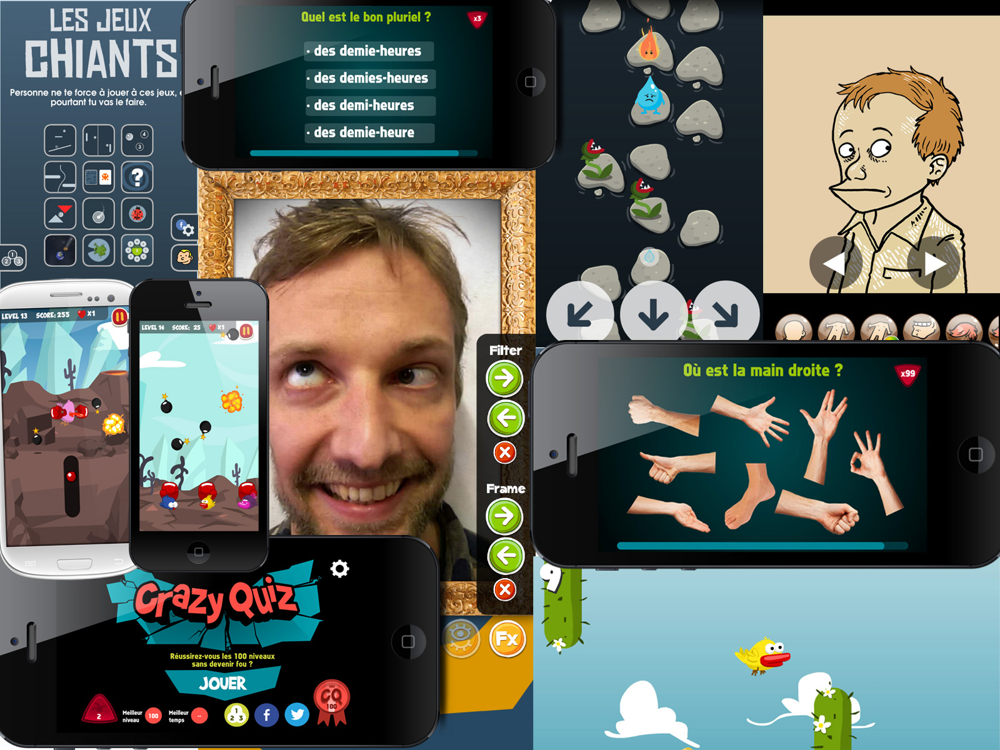
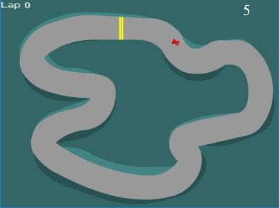
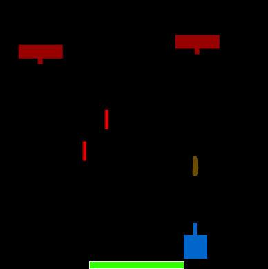
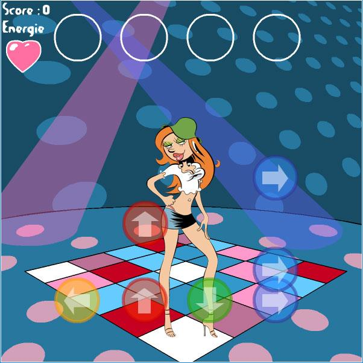
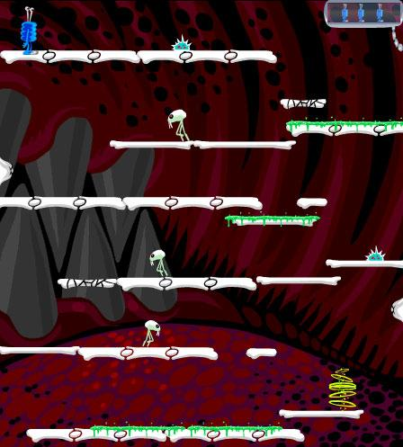
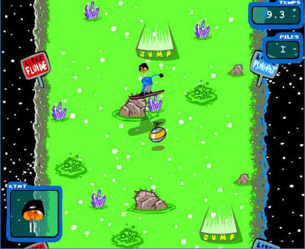

Petite présentation rapide pour commencer : je suis développeur freelance depuis 2001, j’ai travaillé dans 2 sociétés qui ont assez rapidement coulé (pas à cause de moi, enfin j’espère) et je me suis retrouvé au chômage.

Mais pour moi le chômage ne signifiait pas « rester devant la télé et manger des chips », mais plutôt « en profiter pour créer et tester des trucs sur l’ordi ». J’ai acheté pas mal de livres sur différents langages de programmation – ActionScript, Javascript, PHP, SQL… – et j’ai commencé à créer des petits jeux en Flash pour m’amuser.

Ce que j’ai découvert c’est qu’apprendre la programmation (ou tout autre chose) par plaisir permet de progresser véritablement. La motivation ne vous fera pas compter le nombre d’heures passées à apprendre, mais continuer sans rechigner en cas d’échec, et avoir le luxe d’exercer un métier qui est également votre passion.

Car le métier de développeur est un métier de passion, tout du moins c’est ce que j’ai pu constater en travaillant plusieurs fois dans des missions en agence avec d’autres développeurs, qui, le soir en sortant du travail, continuaient à travailler sur leurs projets personnels. Pour la plupart des gens, un développeur est une personne qui passe sa journée devant des lignes de code incompréhensibles, et pour eux il faut avoir de sacrés problèmes psychologiques pour exercer un tel métier ! Mais nous voyons ça comme un plan de travail vierge sur lequel nous construisons des trucs au fur et à mesure, comme un ébéniste qui, avec un gros morceau de bois et pas mal de patience et de talent, fera apparaître une chaise, une étagère ou tout autre objet sorti de son imagination.

Tout en apprenant la programmation à mes débuts, j’ai créé une multitude de petits moteurs de jeu : shoot them up, jeu de plateforme, jeu de voitures, jeu d’arcade… Et je mettais ces petits tests en ligne sur mon blog, me créant ainsi un portfolio qui m’a rapidement permis d’être contacté par des sociétés pour créer des jeux.

_(exemple de premiers jeux que j’ai réalisés)_

---

C’est véritablement comme ça que ma carrière de freelance a commencé, j’ai rapidement travaillé pour Fluide Glacial, Spirou, et d’autres entreprises moins sexy mais pour lesquelles je faisais également des jeux.

_(Exemple de jeux pour Spirou et Fluide Glacial)_

---

J’ai continué (et je continue toujours) à faire des petits jeux dans mon coin, certains remportant plus de succès que d’autres. Un exemple parmi d’autres : en 2008 Georges Bush se prend une chaussure lancée par un journaliste irakien pendant une conférence. La nouvelle me fait rire, je décide d’en faire un petit jeu que je mets en ligne sur mon blog. Le lendemain, mon jeu passe sur la chaîne américaine CNN et près de 500.000 personnes à travers le monde jouent à mon jeu en une journée !

_(« Flying Babush » est encore jouable en ligne – en Flash -)_

C’est pour cela que je continue toujours à faire des jeux, parce que ça me fait marrer, et apparemment ça fait marrer aussi d’autres personnes. Si j’ai un conseil à donner, ne perdez pas patience. Il en faut énormément ! Les technologies changent rapidement, les API sont constamment modifiées avec des changements impliquant une mise à jour de votre code, l’informatique aussi puissante soit-elle, a toujours des côtés aléatoires. Quand Steve Jobs a proclamé la mort de Flash, j’ai dû apprendre d’autres langages pour pouvoir continuer à m’amuser à faire des jeux. C’est-à-dire passer un nombre incalculable d’heure pour arriver à faire la même chose que ce que je faisais auparavant.

Sans la motivation et la passion, c’est clair que j’aurais rapidement abandonné !
