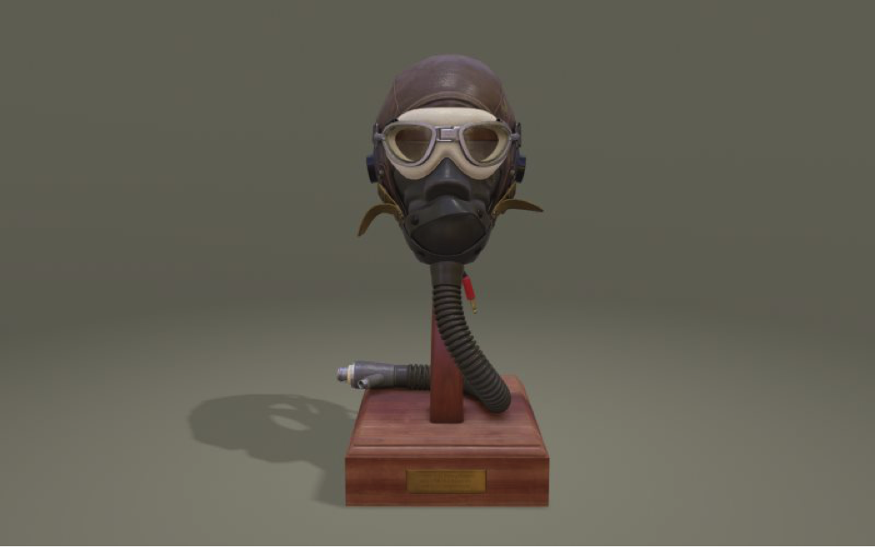

Je suis développeur depuis que j’ai 9 ans. Avec les sous récoltés à cet âge, je me suis offert mon premier Amstrad CPC 464 et j’y ai découvert les joies du BASIC.

Ce fut sans doute le moment le plus marquant de ma vie professionnelle. Moi qui n’étais doué ni pour le dessin, ni pour la peinture ou la musique, je pouvais enfin exprimer ma créativité. Car oui, nous parlons bien de créativité ici.

**Je considère sincèrement que le développement est un art** tout à fait comparable avec la peinture par exemple. Il permet de créer des mondes, de poser sur un papier virtuel ce que notre esprit crée. Certes, cela peut s’avérer bien moins accessible aux béotiens que ne l’est la peinture mais cela ne lui en retire pour autant pas son côté artistique.

Le développement est très clairement une passion comparable à d’autres et de ce fait, je me considère comme chanceux de pouvoir vivre de ma passion. Cette passion (dévorante) ne m’a pas quitté depuis que j’ai écrit mes premiers programmes, il y a maintenant plus de 33 ans. Je dirais même que chaque jour qui passe la renforce, au vu de toutes les merveilles qui s’ouvrent aux développeurs (développement web, mobile, embarqué, IA, robotique, spatial, etc…).

Je travaille aujourd’hui chez Microsoft sur un projet que j’ai créé dans mon « garage » (oui enfin, dans mon appartement parisien) sur mon temps libre : www.babylonjs.com.

À la base, ce projet me permettait une fois de plus d’assouvir ma soif de créativité en créant un outil permettant la mise en place d’univers virtuels (sujet qui me fascine depuis tout petit lorsque je jouais à des jeux comme Populous ou WorldMonger).

Cet outil est basé sur la technologie JavaScript/TypeScript et permet à tout un chacun de créer son propre monde 3D. La technologie est utilisée par de nombreux produits Microsoft comme SharePoint ou PowerPoint mais aussi par d’autres sociétés comme Adobe pour le logiciel Dimension.
Et c’est là, la magie du développement : D’un petit passe-temps personnel, j’ai hérité d’une carrière complète où, aujourd’hui, je dirige une équipe de 8 personnes travaillant toutes sur mon projet. Chaque matin, je me réveille en réalisant la chance que j’ai eu d’apprendre à développer.

Et ce qui m’est arrivé peut sans problème arriver à quiconque se donne la peine de laisser parler sa créativité, son art, son cœur.
Je compare le développement à un art car, comme un artiste, le développeur part d’une feuille blanche et va y coucher dessus ce qu’il construit dans son esprit. Dans le cadre de Babylon.js, il s’agit de mettre dans un outil des services pour que les autres puissent aisément créer leur monde virtuel. Cela passe donc par la mise en place de scènes, de caméras, de lumières, de matériaux, de textures et de tous les éléments constitutifs d’un monde. Ainsi, un utilisateur pourra se servir de ces briques pour construire son monde. C’est pour cela que je parle de créativité : que ce soit pour poser des mots sur un poème, pour choisir le bon trait pour un dessin ou pour décrire dans un algorithme une fonctionnalité, tout ramène à la créativité. Un développeur est un créatif. Un développeur devient un artiste lorsqu’il met de sa personne dans son « œuvre ».

Cette passion peut même s’avérer dévorante au point d’envahir vos pensées jour et nuit. Lorsque je travaille sur un problème complexe, je ressens en moi un feu inextinguible. Je dois absolument accoucher du code nécessaire à la résolution de mon problème et ce, de la manière la plus élégante possible, afin d’être parfaitement satisfait.

Je blogue d’ailleurs plus ou moins régulièrement sur ce sujet sur mon blog (comme [là](https://www.catuhe.com/le-moment-mou/) ou [là](https://www.catuhe.com/le-diable-est-dans-les-details/)).

Bien évidemment, certains développeurs, comme certains peintres ou dessinateurs, ne font pas ça par passion et ce n’est pas un problème en soi. Je voudrais juste insister ici sur le fait que développer par passion est autant possible que de chanter par passion. Vivre de sa passion en tant que développeur est aussi satisfaisant que pour n’importe quel autre métier artistique. **Si développer vous fait vibrer, alors vous avez le monde devant vous !**

David
